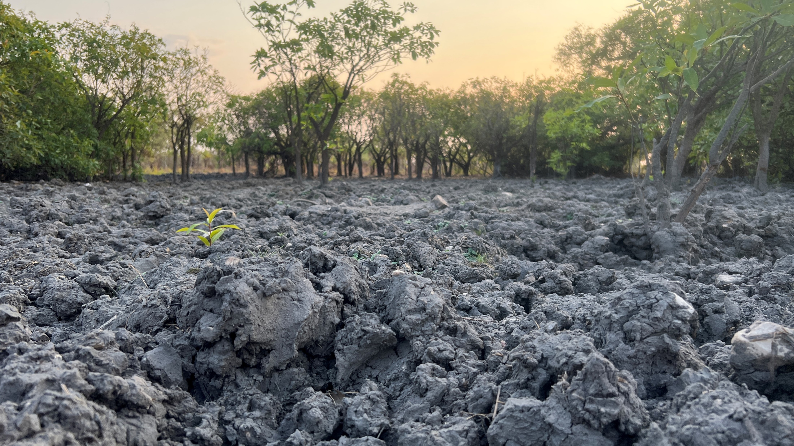
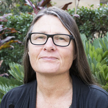
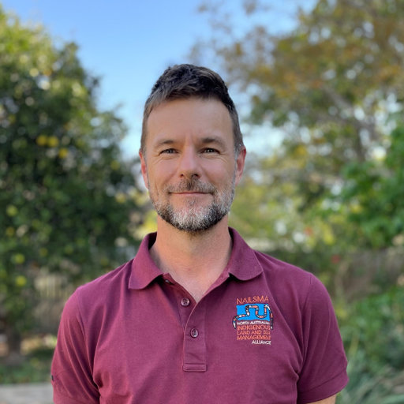

<!-- icon library -->
<link rel="stylesheet" href="https://cdnjs.cloudflare.com/ajax/libs/font-awesome/4.7.0/css/font-awesome.min.css">

```{css, echo=FALSE}
.btndownload {
  background-color: DodgerBlue;
  border: none;
  border-radius: 5px;
  color: white;
  padding: 12px 30px;
  cursor: pointer;
  font-size: 18px;
}

.btndownload:hover {
  background-color: RoyalBlue;
}

.btnsubmit {
  border: 2px solid black;
  border-color: #e7e7e7;
  border-radius: 5px;
  background-color: white;
  color: black;
  padding: 12px 28px;
  font-size: 16px;
  cursor: pointer;
}

.btnsubmit:hover {
  background: #e7e7e7;
}

.button-container {
  display: flex;
}

.rounded-img {
  width: 200px;
  height: 200px;
  border-radius: 50%;
  object-fit: cover;
}

h3 {
  text-align: center;
}

.timeline-simple {
  position: relative;
  max-width: 700px;
  margin: 0px auto;
  padding-left: 0;  
  color: #333;
}

/* vertical line */
.timeline-simple::before {
  content: '';
  position: absolute;
  left: 0;
  top: 0;
  bottom: 0;
  width: 2px;
  background: #ccc;
}

/* paragraphs with left margin to clear dots */
.timeline-simple p {
  position: relative;
  margin-left: 20px;  
  margin-bottom: 16px;
}

/* dots on vertical line */
.timeline-simple p::before {
  content: '';
  position: absolute;
  left: -25px;  
  top: 50%;
  transform: translateY(-50%);
  width: 12px;
  height: 12px;
  background: #18bc9c;
  border-radius: 50%;
  /* border: 2px solid white; */
  box-sizing: content-box;
}


```



<br>

<a id="intro"></a>

### We're developing an ACCU Scheme method to<br><b>reduce emissions by managing introduced hooved animals (ungulates) in wetlands</b>

<br>

We welcome your feedback on our method draft. To participate:

1. Download the method draft below. 
2. <em>(optionally)</em> Watch a webinar from the proponent team (available soon!), and read more about the method development timeline. 
3. Submit your feedback using the form below, or email us directly.

Feedback must be submitted by COB Friday 11 July.

<br>

<div class="btn-container">
<a href=""><button class="btndownload">Download the method draft &nbsp;&nbsp; <i class="fa fa-download"></i></button></a
<br>
<a href="https://docs.google.com/forms/d/e/1FAIpQLScysvS_TACZAgpUUBvtyu3aajCfiWVx4Qdo9Id2GoQ_Xz5ZYQ/viewform"><button class="btnsubmit">Submit your feedback &nbsp;&nbsp; <i class="fa fa-chevron-circle-right"></i></button></a>
</div>

<br>

<a id="webinar"></a>

#### <b>Webinar</b> 

<iframe width="560" height="315" src="https://www.youtube.com/embed/yl_FOaknSfU?si=2QQ7klqdo-DQw-Mr" title="YouTube video player" frameborder="0" allow="accelerometer; autoplay; clipboard-write; encrypted-media; gyroscope; picture-in-picture; web-share" referrerpolicy="strict-origin-when-cross-origin" allowfullscreen></iframe>

<br>

<a id="timeline"></a>

#### <b>Timeline</b>

<div class="timeline-simple">
  <p><em>Nov 2024: method EOI prioritised for development</em></p>
  <p><em>Dec 2024 &ndash; Apr 2025: method draft developed in consultation with technical working groups</em></p>
  <p><em>May 2025: method draft reviewed by working groups and federal government</em></p>
  <p><strong>Jun&ndash;Jul 2025:</strong> revised method draft available for stakeholder feedback</p>
  <p><strong>Aug 2025:</strong> stakeholder feedback reviewed and incorporated into method exposure draft</p>
  <p><strong>Oct 2025:</strong> method exposure draft delivered to the [Emissions Reduction Assurance Committee](https://www.dcceew.gov.au/climate-change/emissions-reduction/accu-scheme/assurance-committee)</p>
</div>

<br>

<a id="team"></a>

#### <b>Proponent team</b> 

This method is being co-developed by the [Northern Australian Indigenous Land Management Alliance](https://nailsma.org.au/) (NAILSMA) and [The University of Queensland](https://www.uq.edu.au/) (UQ). We're working in collaboration with Indigenous peak bodies, local, state and federal governments, NGOs and industry organisations. The lead co-proponents are:


<div style="display: flex; justify-content: center; gap: 40px; flex-wrap: wrap; text-align: center;">

<div>

<div>Prof. Catherine Lovelock (UQ)<br><em>[email Cath](mailto:c.lovelock@uq.edu.au?cc=justin.perry@nailsma.org.au; jack.hill@uqconnect.edu.au&subject=Draft%20ungulate%20ACCU%20Scheme%20method%20enquiry)</em></div>
</div>

<div>

<div>Dr Justin Perry (NAILSMA)<br><em>[email Justin](mailto:justin.perry@nailsma.org.au?cc=c.lovelock@uq.edu.au; jack.hill@uqconnect.edu.au&subject=Draft%20ungulate%20ACCU%20Scheme%20method%20enquiry)</em></div>
</div>

</div>

<br> 
<hr>
